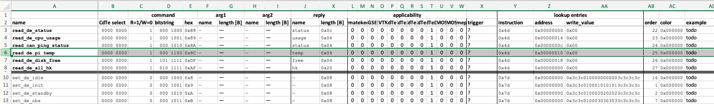

# `commands`
How to add, modify, and remove uplink commands to the FOXSI Formatter.

## Overview
The Formatter is simple and foolish. It listens on its UART port `/dev/ttyAMA2`, with a baud rate of 1200 and 8N1-style packets, for uplink commands. When an uplink command is received for a specific detector system, the Formatter looks up or builds the appropriate output command, and sends it to the system. 

### Uplink commands
An uplink command to the Formatter is a pair of bytes. The first byte identifies the FOXSI system that the command should be routed to. In [`systems.json`](../systems.json), all systems have a `name` and unique `hex` field. The first byte of any uplink command is the `hex` field of the onboard system the command will be sent to. The second byte of the uplink command identifies which command to send that system. 

The detector systems span different physical interfaces for communication (Ethernet, SpaceWire, UART) and different packet structures/command data (TCP, UDP, RMAP, custom packets, etc). By using this two-byte uplink command system, at least the GSE to Formatter interface doesn't need to worry about what bits travel on the wire between the Formatter and CdTe DE, for example. 

## Editing commands
The source data for all commands is stored in .xlsx files here, in this repository, under [`commands/`](../commands/). Command lists are broken down by the system they target. The source spreadsheets are parsed and validated by a Python script ([`validator.py`](../validator.py)) which enforces uniqueness of uplink command byte codes. This script takes in a spreadsheet as an argument and outputs a JSON file. The JSON file is what is ingested by the Formatter or GSE software for populating the command decks for each system. 

After making some changes to one of the .xlsx files, run the Python script like this (example for CdTe 1), passing a path to the Excel file into the script:
```bash
python commands/cdte1/cdte1_command_deck.xlsx
```
This will output a JSON file called `cdte1_commands.json` in the same directory as the .xlsx file. You will see errors print out if the command ID codes are not unique in your source .xlsx file (in column E). The spreadsheet file you pass in should be named as in the above example, i.e. `<detectorname>_command_deck.xlsx`.

The basic function of `validator.py` is to turn every row in the Excel file into a JSON object (part of a JSON array).

### Overview of the command spreadsheet
Here is an example command spreadsheet:



We'll go through columns from right to left. Note that "*Unused*" here means that the value is not meaningful to the functionality of the Formatter or GSE, not that the spreadsheet cell must be blank. In fact, don't leave any cell blank for a command in the spreadsheet, JSON doesn't like that.

> [!NOTE]
> Hexadecimal values in this spreadsheet should be written with the prefix `0x`, like this: `0xff`. But they are not case sensitive, `0x3B` and `0x3b` are equivalent.

| Excel column | Excel header | Description | Constraint | Example |
|--------|--------------|-------------|------------|---------|
| `A`    | `name` | Name for the command. In the GSE, this is the display name. | All lowercase, underscores, alphanumeric. | `command` | 
| `B`    | `CdTe select` | *Unused* | | | 
| `C`    | `R=1/W=0` | Read/write flag bit. Indicate whether this command writes (`0`) data to the system or reads data `1` from it. | Must be `0` or `1` | `0` |
| `D`    | `bitstring` | A unique binary code for this command. | Must be a 7-digit binary value. | `111 1111` | 
| `E`    | `hex` | This is a hexadecimal value calculated by the spreadsheet. It is the read/write bit followed by the command bitstring: `(RW << 7) \| bitstring`. | Don't edit directly. Will be a 2-digit hex value. | `0x7F` |
| `F–G`  | `arg1` | *Unused* | |
| `H–I`  | `arg2` | *Unused* | |
| `J`    | `reply.name`       | The name of the reply value to the command. Use a placeholder character if no reply is sent. | All lowercase, underscores, alphanumeric. | `status` |
| `K`    | `reply.length [B]` | The length of the reply, in bytes, as a hexadecimal string with `0x` prefix. If there is no reply, us `0x00`. Note that SpaceWire *write* commands can receive a confirmation reply, even though they do not read data. | Varies by system. For SpaceWire commands, this is the length of the data field in the reply, not the length of the entire packet. | `0x08` |
| `L-W` | `applicability` | *Unused* | | |
| `X`  | `trigger`        | *Unused* | | |
| `Y`  | `instruction`    | **System-specific, see below.** | | |
| `Z`  | `address`        | **System-specific, see below.** | | |
| `AA`  | `write_value`   | **System-specific, see below.** | | |
| `AB`  | `order`         | An ascending index specifying the command display order in the GSE window. This enables display ordering of commands by the [v3.1.0+ GSE software](https://github.com/foxsi/GSE-FOXSI-4/releases/tag/v3.1.0). | Integers only, decimal representation. | 12 |
| `AC`  | `color`         | An RGB hex value (with `0x` prefix) specifying the display color of the command in the GSE. | A six digit hex value. | `0xff1741` |
| `AD`  | `example`       | *Unused* | | |
| `AE`  | `description`   | *Unused* | | |

The fields `instruction`, `address`, `write_value` are called out as "system-specific" above. They are important. These define the raw values that are transmitted to the remote detector system to command it. 

The specific meaning of these three fields (`instruction`, `address`, and `write_value`) depends on which underlying protocol is used for commanding: [SpaceWire RMAP](#spacewire-rmap-cdte-and-cmos), [Ethernet](#bare-ethernet-housekeeping), or [UART](#bare-uart-timepix). See the following sections for details.

### SpaceWire RMAP (CdTe and CMOS)
For SpaceWire commands, the fields `instruction`, `address`, and `write_value` come straight out of the SpaceWire RMAP standard [ECSS-E-ST-50-52C](https://ecss.nl/wp-content/uploads/standards/ecss-e/ECSS-E-ST-50-52C5February2010.pdf):
- `instruction` is defined in §5.1.4. It is an 8-bit field broadly defining the type of RMAP command being sent and what type of response packet to expect from the remote system. Each bit in the `instruction` byte is a flag defining some characteristic of the packet or the reply being requested. If you're adding a new command and are not sure what to use, find a similar command and use the same instruction byte it has.
- `address` is defined in §5.1.10. It is a little-endian 4-byte field defining the address in remote memory you wish to read or write to.
- `write_value` is the data that will be written into the remote systems memory at the `address` you specify. For write commands, the detector provider will tell you the command value to put. For read commands, data will not be written, and you should put `0x00` as the `write_value` in the spreadsheet as a placeholder.
>[!WARNING]
> In the `instruction` byte, FOXSI has only used 4-byte reply path addresses so far. Formatter software has not been tested with 0, 8, or 12 byte reply path addresses. So I recommend setting the least significant bits of `instruction` to `0b01` (see ECSS-E-ST-50-52C Table 5-2).

>[!NOTE]
> CMOS memory is big-endian, and expects to receive commands in that byte order. So you should set `write_value` appropriately. For example, if I wish to write the bytes `0xf0851001` in a CMOS register, I provide the `write_value` field as `0x011085f0`. This is not the case for CdTe.

>[!NOTE]
> In FOXSI-4, the CdTe command registers were all 12 bytes wide. The CMOS command registers were all 4 bytes wide.

### Bare Ethernet (Housekeeping)
Housekeeping commands are defined purely by the [Housekeeping board software](https://github.com/foxsi/foxsi4-hk). All these commands are three bytes long. If you are modifying these commands, you must also be modifying the Housekeeping board software to accept new commands, and you will know what you are doing.

The `instruction`, `address`, and `write_value` fields for Housekeeping commands must each be one byte long, and are transmitted verbatim to the Houskeeping board in that order (`instruction` the `address` then `write_value`). As written, the `instruction` field specifies the Housekeeping subsystem that is being commanded:
- `0x01` is for the first RTD chip;
- `0x02` is for the second RTD chip;
- `0x03` is for the power distribution controller that switches subsystems on and off;
- `0x04` is for the voltage/current monitor ADC;
- `0x07` is for Housekeeping microcontroller software health data;
- `0x30` is for enabling/disabling readout of different portions of Housekeeping data.

If you are adding new commands for Housekeeping, you will need to modify [`formatter_interface.h`](https://github.com/foxsi/foxsi4-hk/blob/main/formatter_interface.h)/[`formatter_interface.c`](https://github.com/foxsi/foxsi4-hk/blob/main/formatter_interface.c) in the Housekeeping board software.

### Bare UART (Timepix)
Timepix commands are sent over UART and are each a single byte long. The `write_value` column contains the byte that is sent for each command. These values _are identical_ to the unique hex code for the command, so no command translation is needed. For example, if the Formatter receives the uplink command string `0x0d 0x63`, it will look up Timepix using the first byte (`0x0d`) then send the command `0x63` to it.